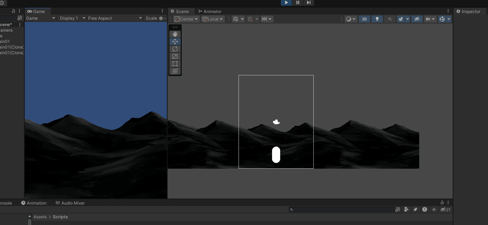
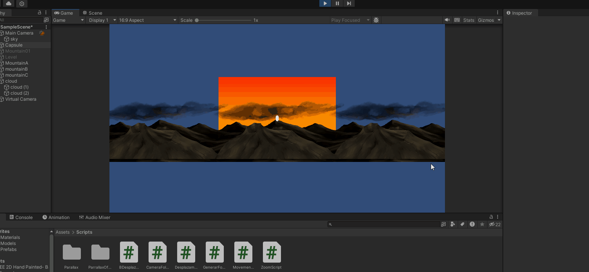

# FDV_Camara

## Punto 1 : Scroll de fondo desplazandose 

## Punto 2 : Scroll de fondo estatico

## Punto3 : Desplazamiento de textura

## Punto4 : Parallax

## Punto5 : Crear y configurar dos camras de cinemachine

## Punto6 : Areas de confinamiento 

## Punto7 : Zoom

